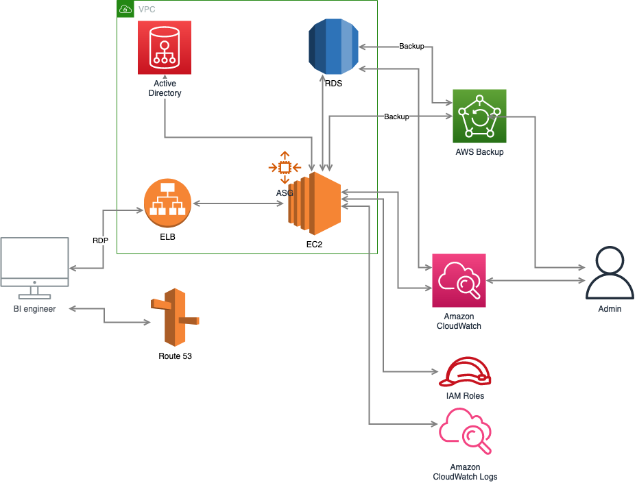

# remote-ec2-pipeline

## usefull commands

- `npm run build` compile typescript to js
- `npm run watch` watch for changes and compile
- `npm run test` perform the jest unit tests
- `npm run cdk -- deploy` deploy this stack to your default AWS account/region
- `npm run cdk -- diff` compare deployed stack with current state
- `npm run cdk -- synthesis` emits the synthesized CloudFormation template

## Requirements

Codestar connection with your preferred Git repository. Set this in the `remote-ec2.config.ts` file

## Diagram

## Documentation

1. EC2 instance with Windows 2019 Datacenter

   - use a AWS managed AMI. These have SSM agent already preinstalled and make managing more easy
   - make sure blockdevices are encrypted and size is correct as described in requirements
   - add securitygroups to the instance to allow RDP and RDS connections
   - Use an Autoscaling Group to schedule the shutdown after working hours for cost saving
   - Use ASG for healthchecks when instance becomes unhealthy to recreate the instance.
   - Monitor Memory and Disk space using Cloudwatch agent and setup Alarms
   - Attach roles to the instance so it is able to connect to Cloudwatch and SSM
   - Use a loadbalancer in front of the ASG and use loadbalancer DNS as A record in the Route53 to point to the correct domain name

2. VPC with public and isolated subnet

   - public subnet is used for EC2 instance
   - isolated subnet is used for RDS instance
   - dont use NAT gateway to limit costs

3. RDS Postgres

   - Create Credentials and store in Secrets Manager. Make sure the password characters are supported by Postgres.
   - Encrypt Postgres and use Detailed monitoring for RDS for enabling RDS insights.
   - Allow connection with EC2 instance security group over Default Postgres port ( 5432 )
   - Add Alarms to monitor DiskSize and Memory usage.
   - Make sure RDS is created in Isolated Subnet

4. Active Directory

   - Not yet properly supported by Cloudformation / CDK
   - Make sure to update password after creation with post deploy script and save password in Secrets Manager / SSM
   - Create AD and use SSM to attach EC2 to AD ( SSM Document )

5. Notifications

   - Use SNS to notify administrators if Alarms occur.

6. AWS Backup

   - Create an Encrypted Vault to store Backups
   - Use TAGS to specify which resources have to be backed up
   - create a plan that runs every 2 hours and retains the backups for 30 days.

7. CI/CD

   - use Code Pipeline and Codebuild for CI/CD
